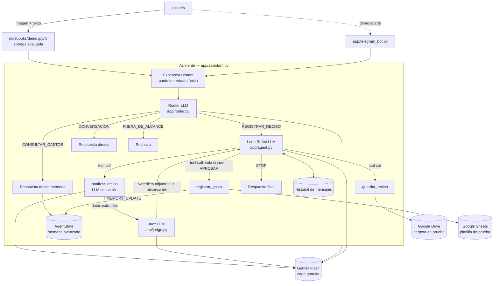
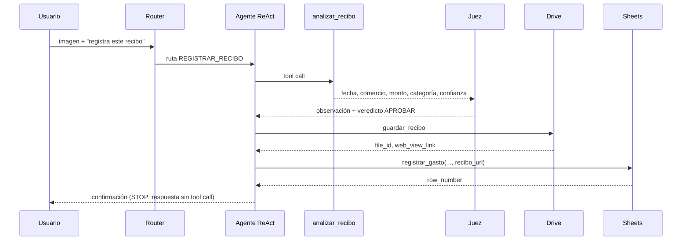

# Arquitectura — Telegram Expense Tracker

## 1. Contexto y objetivos
Agente académico que convierte la foto de un recibo en un gasto registrado y verificable. Objetivos, en orden de prioridad: funcionamiento, simplicidad, trazabilidad, seguridad, cumplimiento de la rúbrica y mantenibilidad. No es un producto comercial.

## 2. Vista general

## 3. Flujo normal (recibo válido)

## 4. Componentes

| Componente | Archivo | Responsabilidad |
|---|---|---|
| Configuración | `app/config.py` | Lee variables de entorno y valida que existan, sin imprimir valores. |
| Modelos de datos | `app/models.py` | `ReceiptData`, `DriveResult`, `SheetResult`, `TraceEvent`, `AgentState`. |
| Trazador | `app/trace.py` | Eventos con timestamp, en consola y JSONL; enmascara secretos. |
| Cliente LLM | `app/llm.py` | Cliente único de Gemini con reintentos ante 429, pausa entre llamadas y contador de uso. |
| Prompts | `app/prompts.py` | Todos los prompts del sistema, versionados. |
| Router | `app/router.py` | Clasifica la entrada en una de 4 rutas (`route_message`); respaldos seguros y evento `ROUTE`. |
| Asistente | `app/assistant.py` | `ExpenseAssistant.handle`: punto de entrada único. Clasifica y ejecuta la ruta: ReAct (`REGISTRAR_RECIBO`), respuesta desde el `AgentState` (`CONSULTAR_GASTOS`), respuesta directa (`CONVERSACION`) o rechazo fijo (`FUERA_DE_ALCANCE`). Mantiene el historial en todas las rutas. |
| Agente | `app/agent.py` | Se usa desde `ExpenseAssistant` en la ruta `REGISTRAR_RECIBO` (y sigue siendo usable directamente). Loop ReAct, condiciones de parada y rieles (Etapa 6); reenvía el historial de la conversación (Etapa 7); con un `AgentState` aplica los rieles de duplicado y confirmación y actualiza la memoria (Etapa 10); tras cada `analizar_recibo` llama al juez y aplica su veredicto antes de guardar y registrar (Etapa 11). |
| Memoria | `app/memory.py` | Operaciones sobre `AgentState` (`record_expense`, `set_user_name`, huella del recibo, `is_duplicate`, confirmación pendiente) con evento `MEMORY_UPDATE`. `app/memory_demo.py` agrupa el ciclo de verificación real. |
| Conversación | `app/conversation.py` | Historial simple: mensajes del SDK tal como se enviaron y recibieron, turno actual y registro de imágenes (`img_N`). |
| Juez | `app/judge.py` | Control independiente entre el análisis y el registro (`judge_receipt`): una llamada LLM con solo la imagen y los datos extraídos que devuelve `JudgeVerdict {veredicto, motivo, senales}`; falla cerrada. `app/judge_demo.py` agrupa los casos de verificación (benigno y adversarial). |
| Tools | `app/tools/*.py` | `analizar_recibo`, `guardar_recibo`, `registrar_gasto`. |
| Demo | `app/telegram_bot.py` | Adaptador de Telegram sobre el mismo agente. |

## 5. Llamadas al LLM

Todas las llamadas incluyen el bloque `SECURITY_SCOPE_v2` (alcance, acciones permitidas/prohibidas y rechazo seguro; la v1 se conserva por trazabilidad, ver A13).

| Llamada | Prompt | Entrada | Salida | Tools expuestas |
|---|---|---|---|---|
| Router | `ROUTER_PROMPT_v2` | Texto del usuario + contexto reciente + indicador de imagen + tipo de confirmación pendiente | JSON `{ruta, motivo}` (temperatura 0.0) | Ninguna |
| Consulta | `QUERY_PROMPT_v2` | Historial de solo texto + `AgentState` y total general calculado por código como dato + pregunta | Texto | Ninguna |
| Conversación | `CHAT_PROMPT_v2` | Historial de solo texto + mensaje (+ nombre conocido) | JSON `{respuesta, nombre_usuario}`; un nombre válido va al `AgentState` | Ninguna |
| Agente ReAct | `AGENT_PROMPT_v3` | Historial + observaciones (+ bloque `<confirmacion_pendiente>` en el turno de confirmación) | Tool call o respuesta final | `analizar_recibo`, `guardar_recibo`, `registrar_gasto` |
| Analizador | `ANALYZER_PROMPT_v1` | Imagen | JSON con schema `ReceiptData` | Ninguna |
| Juez | `JUDGE_PROMPT_v1` | Imagen + datos extraídos como dato (sin historial ni mensajes del agente) | JSON `{veredicto, motivo, senales}` (temperatura 0.0) | Ninguna |

## 6. Memoria
- **Entre rutas (Etapa 9):** `ExpenseAssistant` agrega a la misma `Conversation` el mensaje del usuario y la respuesta final de cualquier ruta. Las rutas sin tools reciben el historial en versión de solo texto (sin llamadas a función ni observaciones, con mensajes del mismo rol unidos) para que los roles alternen; `REGISTRAR_RECIBO` conserva el historial completo.
- **Historial simple (Etapa 7):** `Conversation` en `app/conversation.py` guarda la lista de mensajes por conversación y `ExpenseAgent.run(..., conversation=conv)` la reenvía completa al LLM en cada turno. Se conservan sin modificar el contenido del modelo (firmas de pensamiento), las llamadas a tools y sus observaciones. La instrucción de sistema se envía en cada llamada y no se guarda. El código no extrae datos del historial (el nombre solo viaja en los mensajes). Si el turno termina por `max_steps`, `error_llm` o `respuesta_vacia`, se agrega al historial el texto seguro entregado al usuario para que los roles sigan alternando. La traza registra `turn` y `history_messages` en `USER_INPUT` y `history_messages` en cada `LLM_DECISION`. Los rieles de las tools siguen acotados a una ejecución de `run()`.
- **Memoria avanzada (`AgentState`, Etapa 10):** estado estructurado y separado del historial: `nombre_usuario`, `totales_por_categoria`, `ultimos_gastos` (5, el más reciente al final), `recibos_registrados` (huella: hash de la imagen + campos normalizados), `filas_por_recibo` y `confirmacion_pendiente`. Una instancia por conversación, mantenida en `app/memory.py`: la actualiza el código con lo que observa (la escritura confirmada en Sheets; el nombre desde la salida estructurada de `CONVERSACION`), nunca el LLM, y cada cambio emite `MEMORY_UPDATE` con `antes` y `despues`. Dos usos: responder consultas con cifras del estado y frenar duplicados hasta que el usuario confirme en un turno posterior (`confirmado_por_usuario`, regla `pendiente.turno < Conversation.turn`; el duplicado confirmado llama a Sheets con `permitir_duplicado=True`). No hay persistencia en disco (opcional; no implementada).

## 7. Condiciones de parada
1. El LLM responde sin solicitar herramientas → respuesta final (`STOP`, motivo `respuesta_final`).
2. Se alcanzan `MAX_STEPS = 6` decisiones del LLM sin respuesta final → respuesta segura (`max_steps`). La tool pedida en la decisión número 6 no se ejecuta, y la respuesta solo afirma lo que el código observó.
3. Casos de borde, también como `STOP`: `error_llm` (la API falla tras los reintentos) y `respuesta_vacia` (el modelo no devuelve texto ni llamadas).

Todas se registran como evento `STOP` con su motivo, seguido de `FINAL_RESPONSE`.

### Rieles del loop (código, no prompt)
- Tool desconocida o argumentos faltantes → error como observación; no se ejecuta nada.
- `guardar_recibo` exige un `analizar_recibo` previo en la misma ejecución.
- `registrar_gasto` se bloquea si la URL no es un `web_view_link` devuelto por `guardar_recibo` en la misma ejecución, o si el último análisis tiene confianza menor que 0,7 o algún campo "desconocido" (el LLM debe pedir confirmación).
- Memoria avanzada (Etapa 10, solo con `AgentState`): un recibo ya registrado bloquea `guardar_recibo` y `registrar_gasto` hasta una confirmación del usuario; la baja confianza bloquea `registrar_gasto` hasta una confirmación. `confirmado_por_usuario=true` solo vale con una confirmación pendiente del mismo recibo creada en un turno anterior (en el mismo turno, error como observación). Tras una escritura exitosa se actualiza la memoria y se borra la pendiente; un duplicado reportado por la planilla no se registra como gasto nuevo.
- Juez (Etapa 11): tras cada `analizar_recibo` el código llama al juez; `guardar_recibo` y `registrar_gasto` se bloquean salvo `APROBAR`, o `PEDIR_CONFIRMACION` confirmado por el usuario en un turno posterior (pendiente de tipo `juez`). `RECHAZAR` bloquea de forma definitiva ese recibo (`recibos_rechazados`) y una falla del juez bloquea la ejecución (`juez_no_disponible`).
- Degradación controlada (A12): si faltan las credenciales de Google, las tools devuelven un error estructurado que el LLM recibe como observación; nunca se simula un éxito.

## 8. Seguridad en capas

| Capa | Mecanismo | Qué detiene |
|---|---|---|
| Basal | `SECURITY_SCOPE_v2` en todas las llamadas (garantía estructural en `app/llm.py`) y errores de tools saneados (`app/security.py`) | Peticiones fuera de alcance, jailbreaks simples y filtración de rutas o configuración. |
| Flujo | Router: las rutas `FUERA_DE_ALCANCE`, `CONVERSACION` y `CONSULTAR_GASTOS` no declaran ninguna tool (cero `TOOL_CALL`, verificado en pruebas). No es un filtro: si clasifica mal, el alcance y los rieles siguen activos. `FUERA_DE_ALCANCE` responde con texto fijo, sin LLM | Ejecución de herramientas cuando no corresponde. |
| Juez | Veredicto aplicado por código antes de guardar y registrar: `RECHAZAR` bloquea para siempre ese recibo, `PEDIR_CONFIRMACION` exige confirmación en un turno posterior, y una falla del juez bloquea | Datos incoherentes con la imagen e inyección dentro de la imagen. |
| Validación | `registrar_gasto` valida categoría, monto y que la URL provenga de Drive | Escrituras con datos inválidos. |
| Credenciales | Variables de entorno; trazador con enmascaramiento | Fuga de secretos en código, trazas o git. |

## 9. Trazabilidad
Eventos: `USER_INPUT`, `ROUTE`, `LLM_DECISION`, `TOOL_CALL`, `TOOL_RESULT`, `JUDGE_VERDICT`, `MEMORY_UPDATE`, `RETRY`, `STOP` y `FINAL_RESPONSE`. Cada uno lleva timestamp y se escribe legible en consola y en `traces/*.jsonl`.

## 10. Modelos

| Rol | Modelo | Acceso | Quién paga |
|---|---|---|---|
| Ejecución (todas las llamadas del agente) | Gemini Flash, capa gratuita. ID exacto: **`gemini-3.5-flash-lite`** (confirmado por el autor el 2026-09-30; verificación real pendiente) | SDK oficial de Gemini con `GEMINI_API_KEY` | Nadie (gratuito) |
| Desarrollo | Claude (claude.ai), según la adenda A1 de `docs/dev_prompts.md` | — | El autor |

## 11. Decisiones y compromisos

| Decisión | Alternativa descartada | Motivo |
|---|---|---|
| Gemini Flash gratuito para el agente | Muse Spark vía OpenRouter; modelos `:free` de OpenRouter; Ollama local | El revisor no paga; usa la misma cuenta Google que Drive y Sheets. Los `:free` tienen pocas llamadas diarias e identidad de modelo variable; un modelo local exige hardware. |
| Notebook sin Telegram | Notebook con Telegram | El revisor puede ejecutar todo sin crear un bot; Telegram queda como demo sobre el mismo agente. |
| Juez aplicado por código entre análisis y registro | Juez como tool opcional del LLM | Si el LLM pudiera omitirlo, el control no sería independiente. |
| Router antes del loop ReAct | Un solo prompt que decide todo | Hace observable la ruta elegida (evidencia del bono) y evita exponer tools cuando no corresponde. |
| Planilla solo de agregar | Edición o borrado de filas | Permite repetir la acción con seguridad; borrar está fuera de alcance. |
| Sin RAG ni MCP | Redis del curso / servidor MCP | El caso no necesita corpus ni herramientas externas adicionales. |
