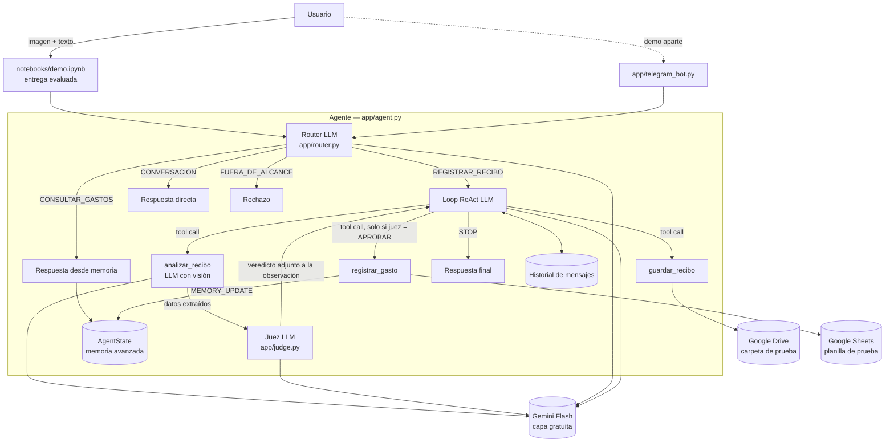
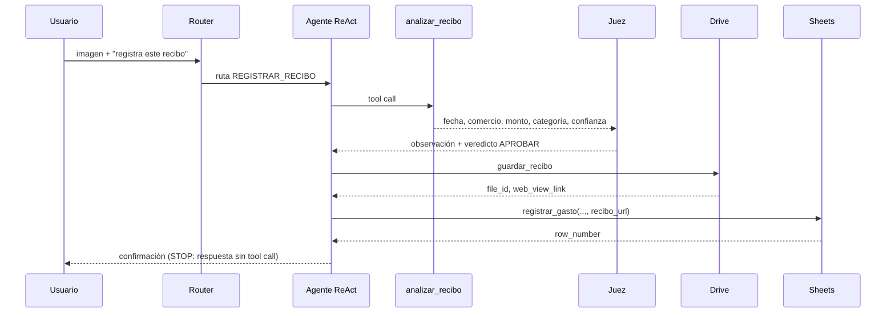

# Arquitectura — Telegram Expense Tracker

## 1. Contexto y objetivos
Agente académico que convierte la foto de un recibo en un gasto registrado y verificable. Objetivos, en orden de prioridad: funcionamiento, simplicidad, trazabilidad, seguridad, cumplimiento de la rúbrica y mantenibilidad. No es un producto comercial.

## 2. Vista general

## 3. Flujo normal (recibo válido)

## 4. Componentes

| Componente | Archivo | Responsabilidad |
|---|---|---|
| Configuración | `app/config.py` | Lee variables de entorno y valida que existan, sin imprimir valores. |
| Modelos de datos | `app/models.py` | `ReceiptData`, `DriveResult`, `SheetResult`, `TraceEvent`, `AgentState`. |
| Trazador | `app/trace.py` | Eventos con timestamp, en consola y JSONL; enmascara secretos. |
| Cliente LLM | `app/llm.py` | Cliente único de Gemini con reintentos ante 429, pausa entre llamadas y contador de uso. |
| Prompts | `app/prompts.py` | Todos los prompts del sistema, versionados. |
| Router | `app/router.py` | Clasifica la entrada en una de 4 rutas. |
| Agente | `app/agent.py` | Loop ReAct, condiciones de parada y rieles (Etapa 6); historial, juez y memoria se agregan en etapas posteriores. |
| Juez | `app/judge.py` | Control independiente entre el análisis y el registro. |
| Tools | `app/tools/*.py` | `analizar_recibo`, `guardar_recibo`, `registrar_gasto`. |
| Demo | `app/telegram_bot.py` | Adaptador de Telegram sobre el mismo agente. |

## 5. Llamadas al LLM

Todas las llamadas incluyen el bloque `SECURITY_SCOPE_v1` (alcance y acciones permitidas/prohibidas).

| Llamada | Prompt | Entrada | Salida | Tools expuestas |
|---|---|---|---|---|
| Router | `ROUTER_PROMPT_v1` | Texto del usuario + indicador de imagen | JSON `{ruta, motivo}` | Ninguna |
| Agente ReAct | `AGENT_PROMPT_v1` | Historial + observaciones | Tool call o respuesta final | `analizar_recibo`, `guardar_recibo`, `registrar_gasto` |
| Analizador | `ANALYZER_PROMPT_v1` | Imagen | JSON con schema `ReceiptData` | Ninguna |
| Juez | `JUDGE_PROMPT_v1` | Imagen + datos extraídos | JSON `{veredicto, motivo}` | Ninguna |

## 6. Memoria
- **Historial simple:** lista de mensajes por conversación, reenviada completa al LLM en cada turno.
- **Memoria avanzada (`AgentState`):** estado estructurado y separado del historial: `nombre_usuario`, `totales_por_categoria`, `ultimos_gastos` y `recibos_registrados` (huella para detectar duplicados). Se actualiza tras cada registro y se usa para responder consultas y para frenar duplicados. La persistencia en `state/` es opcional.

## 7. Condiciones de parada
1. El LLM responde sin solicitar herramientas → respuesta final (`STOP`, motivo `respuesta_final`).
2. Se alcanzan `MAX_STEPS = 6` decisiones del LLM sin respuesta final → respuesta segura (`max_steps`). La tool pedida en la decisión número 6 no se ejecuta, y la respuesta solo afirma lo que el código observó.
3. Casos de borde, también como `STOP`: `error_llm` (la API falla tras los reintentos) y `respuesta_vacia` (el modelo no devuelve texto ni llamadas).

Todas se registran como evento `STOP` con su motivo, seguido de `FINAL_RESPONSE`.

### Rieles del loop (código, no prompt)
- Tool desconocida o argumentos faltantes → error como observación; no se ejecuta nada.
- `guardar_recibo` exige un `analizar_recibo` previo en la misma ejecución.
- `registrar_gasto` se bloquea si la URL no es un `web_view_link` devuelto por `guardar_recibo` en la misma ejecución, o si el último análisis tiene confianza menor que 0,7 o algún campo "desconocido" (el LLM debe pedir confirmación).
- Degradación controlada (A12): si faltan las credenciales de Google, las tools devuelven un error estructurado que el LLM recibe como observación; nunca se simula un éxito.

## 8. Seguridad en capas

| Capa | Mecanismo | Qué detiene |
|---|---|---|
| Basal | `SECURITY_SCOPE_v1` en todas las llamadas | Peticiones fuera de alcance y jailbreaks simples. |
| Flujo | Router: las rutas `FUERA_DE_ALCANCE`, `CONVERSACION` y `CONSULTAR_GASTOS` no exponen tools de escritura | Ejecución de herramientas cuando no corresponde. |
| Juez | Veredicto aplicado por código: sin `APROBAR` no se ejecuta `registrar_gasto` | Datos incoherentes e inyección dentro de la imagen. |
| Validación | `registrar_gasto` valida categoría, monto y que la URL provenga de Drive | Escrituras con datos inválidos. |
| Credenciales | Variables de entorno; trazador con enmascaramiento | Fuga de secretos en código, trazas o git. |

## 9. Trazabilidad
Eventos: `USER_INPUT`, `ROUTE`, `LLM_DECISION`, `TOOL_CALL`, `TOOL_RESULT`, `JUDGE_VERDICT`, `MEMORY_UPDATE`, `RETRY`, `STOP` y `FINAL_RESPONSE`. Cada uno lleva timestamp y se escribe legible en consola y en `traces/*.jsonl`.

## 10. Modelos

| Rol | Modelo | Acceso | Quién paga |
|---|---|---|---|
| Ejecución (todas las llamadas del agente) | Gemini Flash, capa gratuita. ID exacto: **`gemini-3.5-flash-lite`** (confirmado por el autor el 2026-09-30; verificación real pendiente) | SDK oficial de Gemini con `GEMINI_API_KEY` | Nadie (gratuito) |
| Desarrollo | Claude (claude.ai), según la adenda A1 de `docs/dev_prompts.md` | — | El autor |

## 11. Decisiones y compromisos

| Decisión | Alternativa descartada | Motivo |
|---|---|---|
| Gemini Flash gratuito para el agente | Muse Spark vía OpenRouter; modelos `:free` de OpenRouter; Ollama local | El revisor no paga; usa la misma cuenta Google que Drive y Sheets. Los `:free` tienen pocas llamadas diarias e identidad de modelo variable; un modelo local exige hardware. |
| Notebook sin Telegram | Notebook con Telegram | El revisor puede ejecutar todo sin crear un bot; Telegram queda como demo sobre el mismo agente. |
| Juez aplicado por código entre análisis y registro | Juez como tool opcional del LLM | Si el LLM pudiera omitirlo, el control no sería independiente. |
| Router antes del loop ReAct | Un solo prompt que decide todo | Hace observable la ruta elegida (evidencia del bono) y evita exponer tools cuando no corresponde. |
| Planilla solo de agregar | Edición o borrado de filas | Permite repetir la acción con seguridad; borrar está fuera de alcance. |
| Sin RAG ni MCP | Redis del curso / servidor MCP | El caso no necesita corpus ni herramientas externas adicionales. |
