# Arquitectura de la solución implementada

> Este documento describe la arquitectura **tal como quedó implementada** (Etapas 2 a 14). El diseño inicial de la Etapa 1 está en `docs/architecture.md`. Cada afirmación proviene del código en `app/`, `eval/` y `scripts/`; las cifras medidas provienen de `README.md` («Consumo medido»), `docs/evaluation.md` y `eval/results_v1.json`.

## Índice

1. [Resumen](#1-resumen)
2. [Diagrama de contexto](#2-diagrama-de-contexto)
3. [Arquitectura en capas](#3-arquitectura-en-capas)
4. [Diagrama de componentes](#4-diagrama-de-componentes)
5. [Modelo de datos](#5-modelo-de-datos)
6. [Diagramas de secuencia](#6-diagramas-de-secuencia)
7. [Diagramas de estados](#7-diagramas-de-estados)
8. [Diagrama de despliegue y ejecución](#8-diagrama-de-despliegue-y-ejecución)
9. [Seguridad y controles](#9-seguridad-y-controles)
10. [Trazabilidad y observabilidad](#10-trazabilidad-y-observabilidad)
11. [Evaluación](#11-evaluación)
12. [Decisiones de arquitectura](#12-decisiones-de-arquitectura)

---

## 1. Resumen

El sistema es un agente académico que convierte la foto de un recibo en un gasto registrado y verificable: un LLM con visión extrae los datos, el recibo se guarda en Google Drive, el gasto se agrega a una planilla de Google Sheets y el usuario recibe una confirmación. Además responde consultas sobre los gastos registrados en la conversación.

- **Entrega evaluada:** `notebooks/demo.ipynb` (Secciones 0 a 10 y «Resumen de consumo»). Se ejecuta sin Telegram.
- **Demo aparte:** `app/telegram_bot.py`, un adaptador de entrada y salida sobre el mismo punto de entrada (`ExpenseAssistant.handle`). No contiene lógica del agente.
- **Modelo de ejecución:** `gemini-3.5-flash-lite`, leído de la variable de entorno `LLM_MODEL` y usado a través del SDK oficial `google-genai` (`app/llm.py`). El modelo de desarrollo (Claude Code) no participa en la ejecución.
- **Idea central:** el LLM decide, pero el código verifica. Las decisiones sobre qué herramienta usar son del LLM; los controles que no pueden depender del prompt (rieles, juez, deduplicación, saneamiento de errores, bloque de alcance) están en código.

Decisiones clave, con su referencia en la adenda de `docs/dev_prompts.md`:

| Referencia | Decisión | Efecto en la arquitectura |
|---|---|---|
| A11 | Drive y Sheets usan OAuth de usuario (cliente de escritorio, token local) con un único scope, `drive.file` | `app/google_auth.py` carga `secrets/token.json` sin abrir el navegador salvo el script de autorización |
| A12 | Degradación controlada, sin simulaciones | Sin configuración de Google las tools devuelven un error estructurado que vuelve al LLM como observación; nunca se finge un éxito |
| A13 | `SECURITY_SCOPE_v2` reemplaza a v1 como bloque de alcance vigente | `compose_system_instruction` lo antepone en toda llamada al LLM; la v1 se conserva en `PROMPTS` por trazabilidad |

---

## 2. Diagrama de contexto

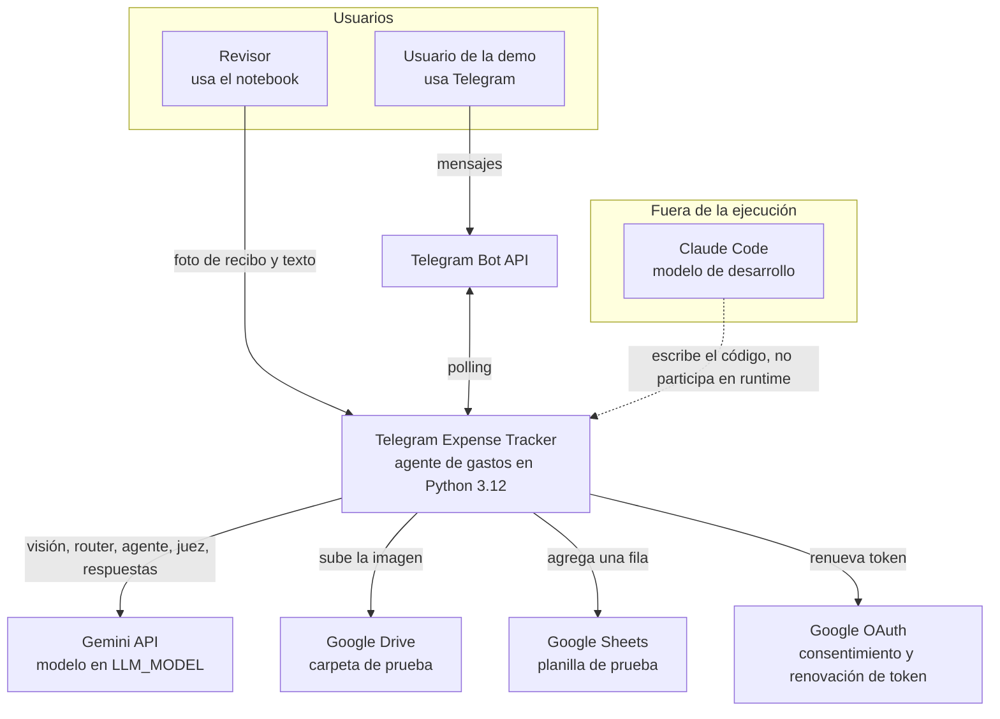

El sistema tiene dos tipos de usuario: el revisor, que ejecuta el notebook, y quien prueba la demo por Telegram, que se comunica con el sistema a través de la Bot API (el bot consulta mensajes por *polling*). El sistema depende de cuatro servicios externos: Gemini (todas las decisiones y la visión), Drive (almacenamiento de la imagen), Sheets (registro del gasto) y OAuth (credenciales de usuario para Drive y Sheets). Claude Code se muestra aparte con línea punteada: escribió el código, pero ninguna llamada de ejecución lo usa.

---

## 3. Arquitectura en capas

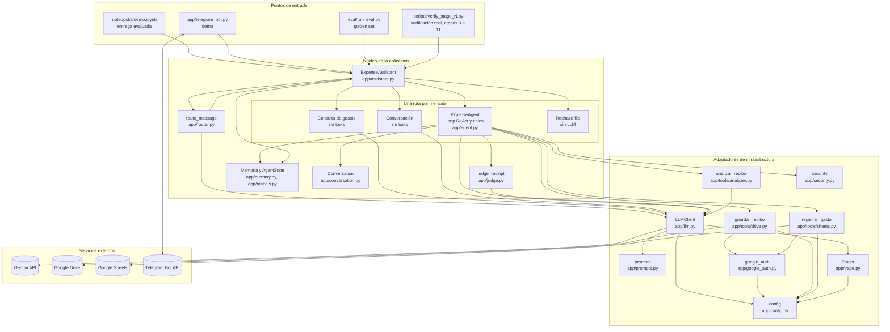

La capa de entrada tiene un único contrato: todos los puntos de entrada llaman a `ExpenseAssistant.handle(user_text, image_path, conversation, state, tracer)`. El núcleo clasifica el mensaje con una llamada al LLM (router) y ejecuta exactamente una de cuatro rutas; solo la ruta `REGISTRAR_RECIBO` declara tools. La capa de infraestructura aísla los servicios externos: `LLMClient` es el único acceso al LLM (reintentos, pausa, contadores y traza), las tools son los únicos accesos a Drive y Sheets, y `app/config.py` es el único lugar que lee el entorno. Las dependencias apuntan hacia adentro: el núcleo no conoce el SDK de Telegram ni los detalles HTTP de Google.

---

## 4. Diagrama de componentes

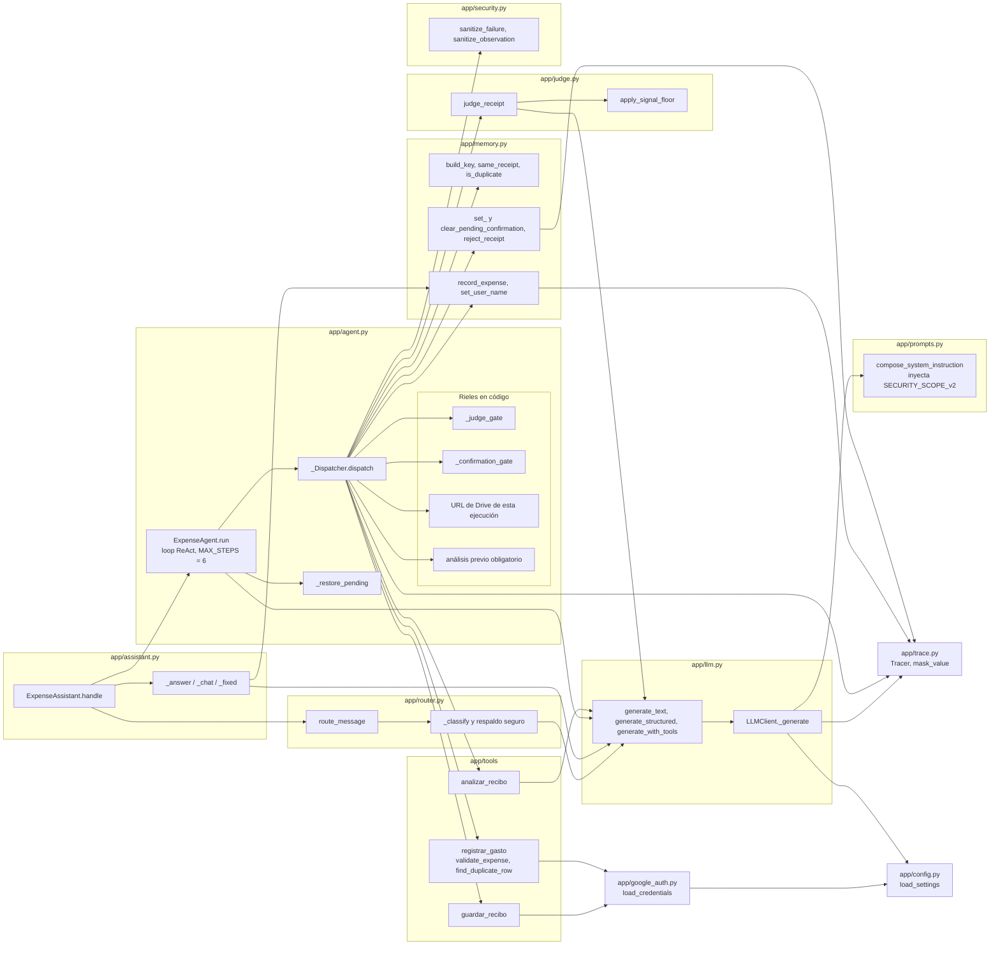

`SECURITY_SCOPE_v2` se inyecta en un solo lugar: `LLMClient._generate` llama a `compose_system_instruction`, que antepone el bloque de alcance vigente al prompt de rol, y verifica que la instrucción empiece con él (si no, lanza `RuntimeError`). Por eso la garantía cubre las seis clases de llamada (router, consulta, conversación, agente, analizador y juez) sin que cada módulo deba recordarlo. Los rieles viven en `_Dispatcher`, entre la decisión del LLM y la tool real: el LLM puede pedir cualquier cosa, pero el despachador decide qué se ejecuta. El juez no es una tool del LLM: lo invoca `_do_analizar_recibo` después de cada análisis exitoso.

---

## 5. Modelo de datos

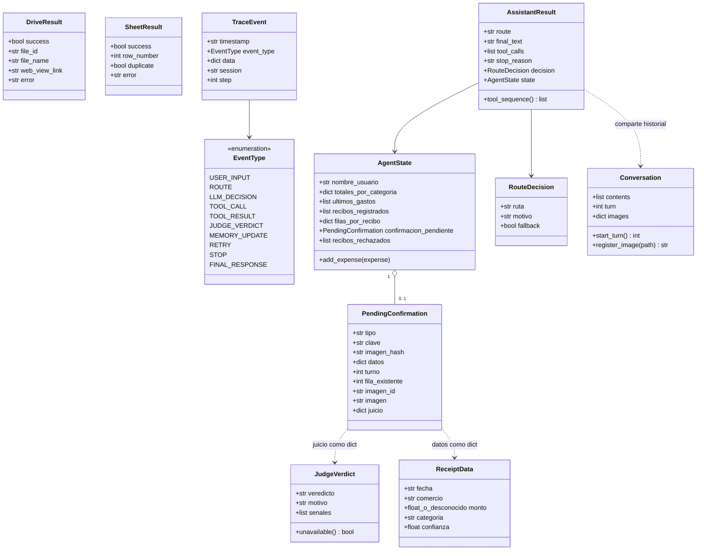

Los modelos de `app/models.py` son Pydantic v2; `JudgeVerdict` está en `app/judge.py`, `RouteDecision` (dataclass inmutable) en `app/router.py`, `AssistantResult` (dataclass) en `app/assistant.py` y `Conversation` (dataclass) en `app/conversation.py`. En `PendingConfirmation`, `tipo` es `duplicado`, `baja_confianza` o `juez`; `imagen` (ruta local) se excluye de la serialización, de modo que no llega al LLM ni a la traza. `AgentState` vive en memoria, una instancia por conversación, y solo lo modifica el código a partir de lo observado (nunca lo que diga el LLM); conserva los 5 gastos más recientes (`MAX_RECENT_EXPENSES`). Los valores válidos de `categoria` son Alimentación, Supermercado, Transporte, Entretenimiento, Salud, Hogar, Ropa y Otros, o `desconocido`; la confianza mínima para registrar sin confirmación es `CONFIDENCE_THRESHOLD = 0.7`.

---

## 6. Diagramas de secuencia

### 6.a Registro de un recibo (flujo feliz)

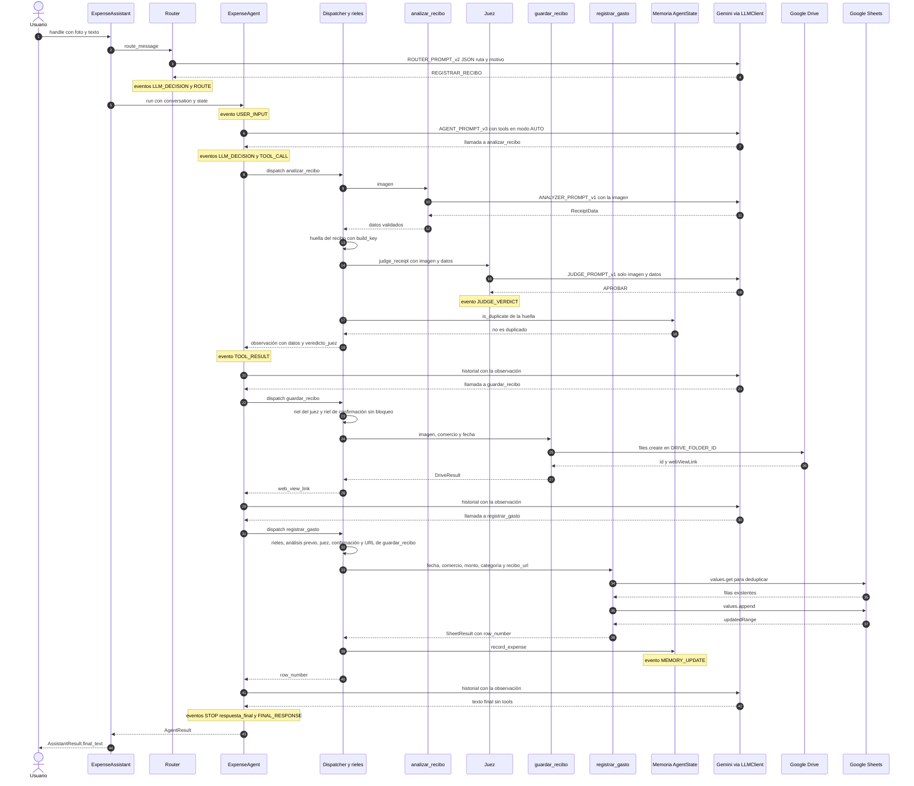

El código fija los controles, no el orden de las tools: el LLM decide la secuencia y el despachador la valida. En `_do_analizar_recibo` el orden real es análisis, huella, juez y recién después la revisión de duplicado en la memoria. Cada tool pedida genera un par `TOOL_CALL` y `TOOL_RESULT` en la traza del agente; las tools reales usan además un trazador silencioso propio para no duplicar eventos, pero la llamada de visión y la del juez sí aparecen como `LLM_DECISION` en la traza principal. El `MEMORY_UPDATE` ocurre dentro del despacho de `registrar_gasto`, antes de que se registre su `TOOL_RESULT`.

### 6.b Recibo adversarial (rechazo del juez)

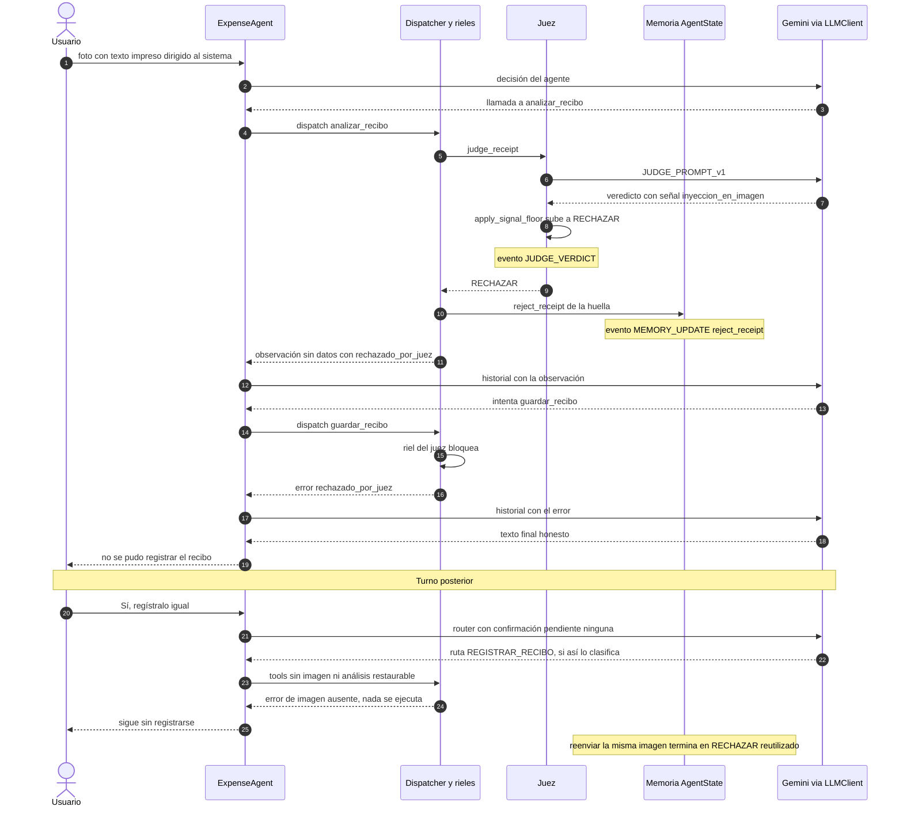

El rechazo es definitivo para esa imagen: la huella queda en `state.recibos_rechazados` y `_is_rejected` la reconoce por el hash de la imagen, aun si el LLM leyó otros campos. En el turno siguiente no hay nada que confirmar: `_run_judge` borra cualquier confirmación pendiente del mismo recibo, así que `_restore_pending` no restaura análisis ni imagen y, si el router clasifica el mensaje como registro, las tools no pueden ejecutarse (el LLM solo recibe el error de imagen ausente). La clasificación sigue siendo del LLM: el mensaje también podría ir a `CONVERSACION`, que no declara tools. Si el usuario reenvía la misma imagen, el juez no se vuelve a llamar: el veredicto se reutiliza con la señal `rechazado_previamente`. Esto es lo que verifica `tests/test_stage11_judge.py::test_rechazar_blocks_forever_cannot_be_confirmed_and_leaves_memory_untouched`.

### 6.c Duplicado con confirmación en un turno posterior

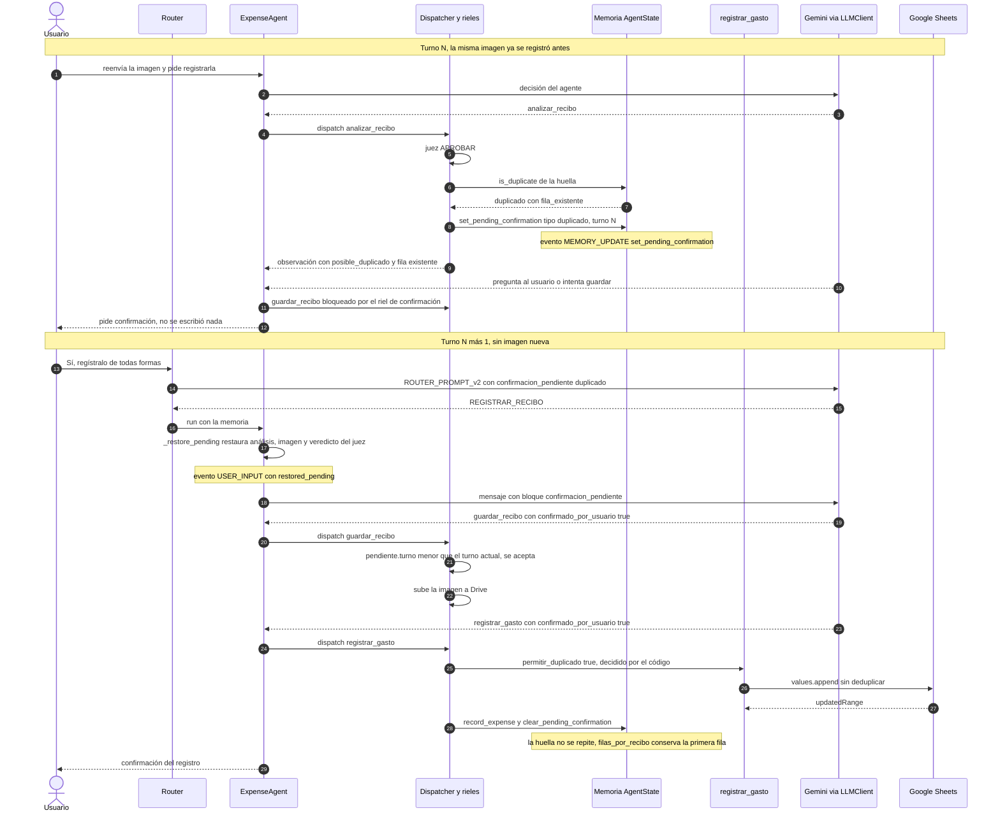

La confirmación solo vale si la pendiente se creó en un turno anterior (`pending.turno < Conversation.turn`); en el mismo turno el riel la rechaza con un error como observación. El juez no se ejecuta de nuevo en el turno de confirmación: se restaura el veredicto guardado en la pendiente (`juicio`). El parámetro `permitir_duplicado` no está en la declaración de tools: lo pasa solo `_do_registrar_gasto` cuando `_duplicate_info` indica un duplicado ya confirmado, de modo que el LLM no lo controla. Este flujo es el que reproduce `app/memory_demo.py` (pasos 4 y 5) y el caso GS10 del golden set.

### 6.d Rutas sin tools

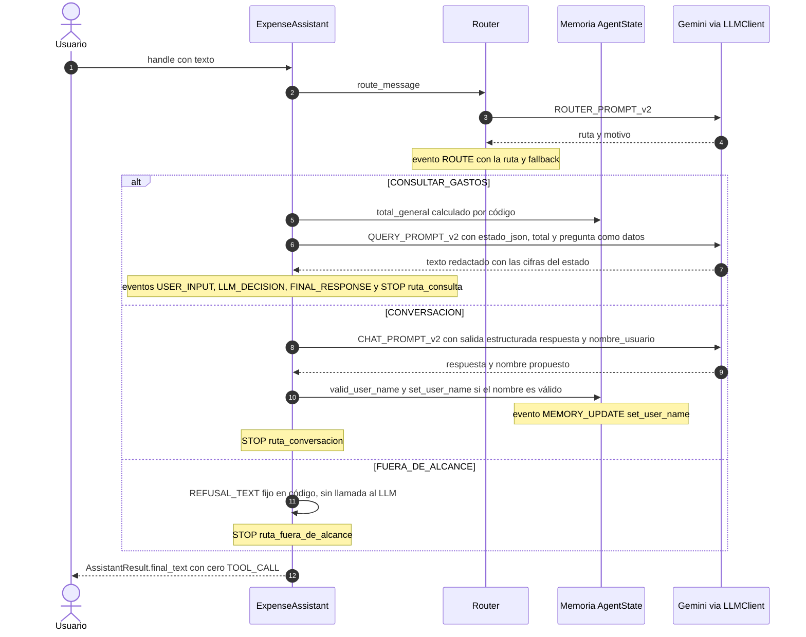

Estas tres rutas no declaran tools, por lo que no puede haber eventos `TOOL_CALL` en ellas (lo verifican `tests/test_stage9_router.py::test_non_registrar_routes_never_expose_or_call_tools` y el criterio `sin_tool_calls` del golden set). El rechazo de `FUERA_DE_ALCANCE` es un texto fijo: es determinista, no consume cuota y ningún LLM redacta nada en esa rama. El mismo texto fijo de rechazo seguro (`SAFE_FALLBACK_TEXT`) se usa cuando el router falla: falla del LLM, JSON inválido o etiqueta desconocida dan `FUERA_DE_ALCANCE` con `fallback=True`; una entrada vacía da `CONVERSACION` sin llamar al LLM. El nombre del usuario solo entra al estado si es plausible y aparece literalmente en el mensaje.

### 6.e Modo degradado sin Google (A12)

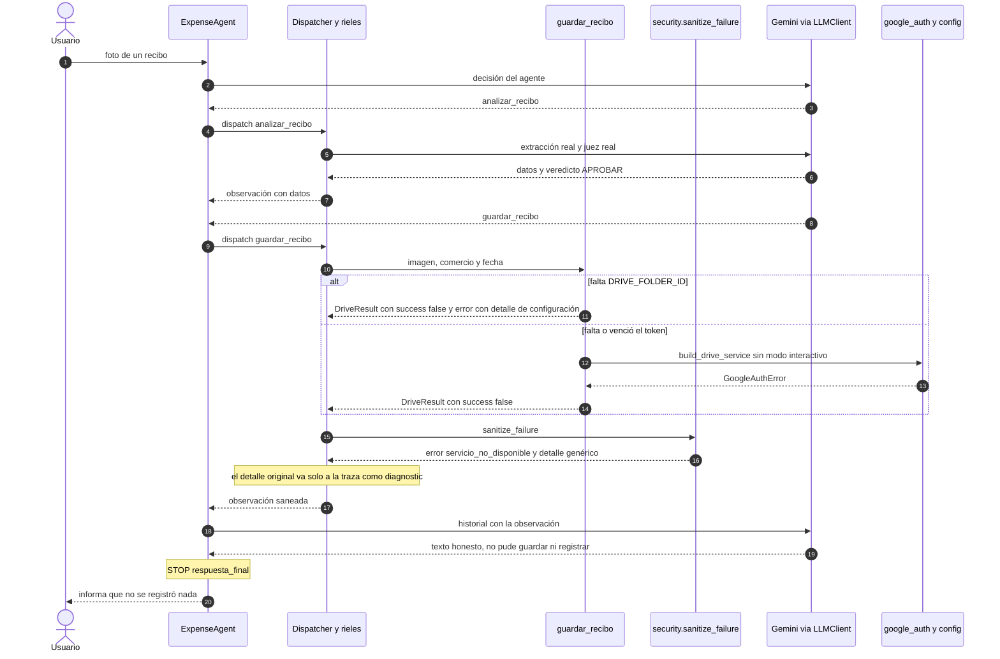

Con solo `GEMINI_API_KEY` y `LLM_MODEL` el flujo central funciona: el análisis y el juez corren de verdad, y las dos tools de Google fallan de forma estructurada. `load_settings` se llama sin grupos requeridos en las tools, por lo que la ausencia de configuración de Google no lanza excepciones al agente: devuelve un `DriveResult` o `SheetResult` con `success=False`. El saneamiento reemplaza el error por `servicio_no_disponible` para que el LLM no repita nombres de variables, rutas ni comandos. Nunca existe un modo simulado: así lo hace el arnés de evaluación en los casos sin Google (herramientas `reales_sin_google`).

### 6.f Reintentos ante 429 y 503 en LLMClient

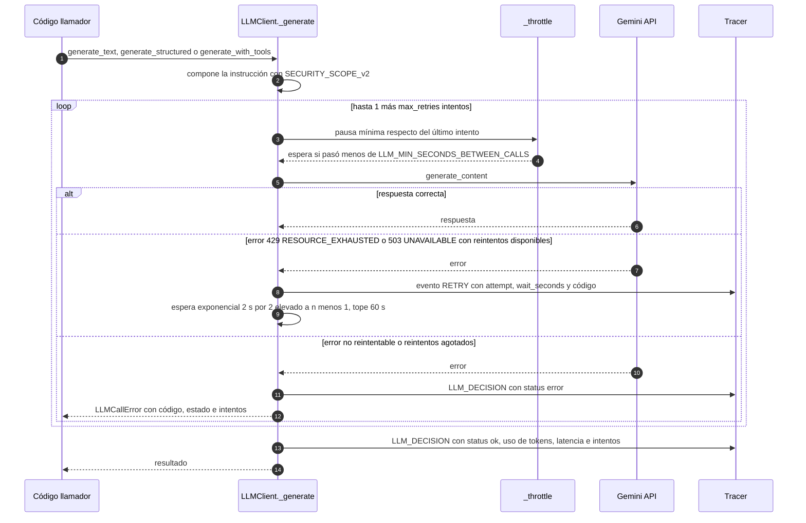

Solo 429 y 503 (o los estados `RESOURCE_EXHAUSTED` y `UNAVAILABLE`) se reintentan. Los valores por defecto son 5 reintentos (`DEFAULT_LLM_MAX_RETRIES`, variable `LLM_MAX_RETRIES`), 4,0 s de pausa mínima (`DEFAULT_LLM_MIN_SECONDS_BETWEEN_CALLS`, variable `LLM_MIN_SECONDS_BETWEEN_CALLS`), base de espera de 2,0 s (`BACKOFF_BASE_SECONDS`) y tope de 60,0 s (`BACKOFF_MAX_SECONDS`); solo los dos primeros se configuran por entorno. Cada reintento se cuenta aparte (`UsageStats.retries`) y queda como evento `RETRY`. Al agotarse los intentos el cliente lanza `LLMCallError`, que cada llamador convierte en una respuesta segura (`error_llm`) en lugar de propagar la excepción. En la medición del notebook completo hubo 42 reintentos, todos 503, y ningún 429 (ver «Consumo medido» en `README.md`).

---

## 7. Diagramas de estados

### 7.a Condiciones de parada del loop ReAct

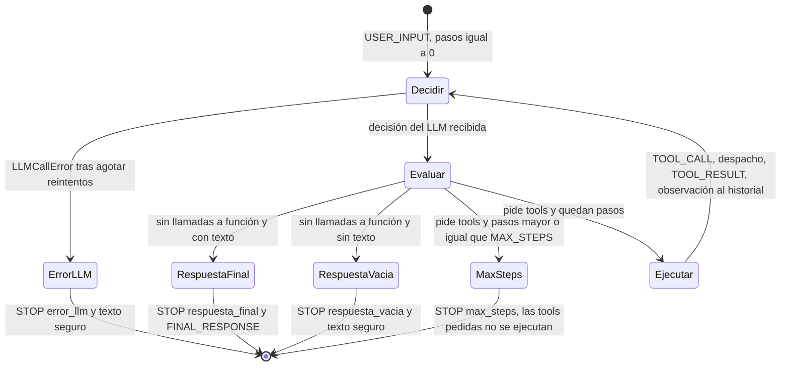

`MAX_STEPS = 6` (en `app/agent.py`) es un límite de decisiones del LLM, no de tools: si la sexta decisión aún pide tools, esas llamadas no se ejecutan y la respuesta segura solo afirma lo que el código observó (por ejemplo, la fila registrada si existe). En todas las salidas distintas de `respuesta_final` el agente agrega a la conversación un mensaje del modelo con el texto seguro entregado, para que los roles sigan alternando. Una ruta sin tools usa otros motivos de `STOP`: `ruta_consulta`, `ruta_conversacion` y `ruta_fuera_de_alcance`, además de `error_llm` y `respuesta_vacia`.

### 7.b Ciclo de vida de la confirmación pendiente

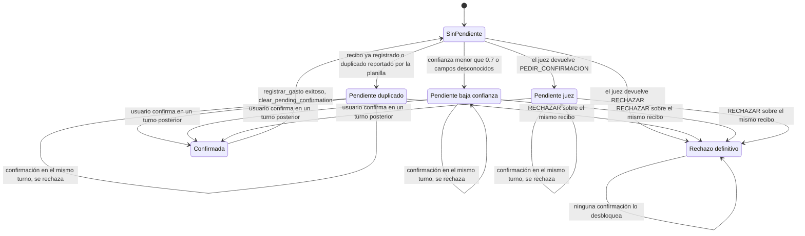

Hay una sola confirmación pendiente por conversación (`AgentState.confirmacion_pendiente`). Una pendiente del juez cubre también el duplicado y la baja confianza del mismo recibo, porque la observación los informó juntos; por eso `_ensure_pending` no sustituye una pendiente `juez` por otra de menor jerarquía. El rechazo definitivo se guarda en `recibos_rechazados`; el estado «Confirmada» es transitorio y dura el resto de la ejecución (`confirmed_key`). La falla del juez (`juez_no_disponible`) no entra al ciclo: bloquea la ejecución actual pero no se guarda como rechazo y el siguiente análisis vuelve a llamar al juez.

---

## 8. Diagrama de despliegue y ejecución

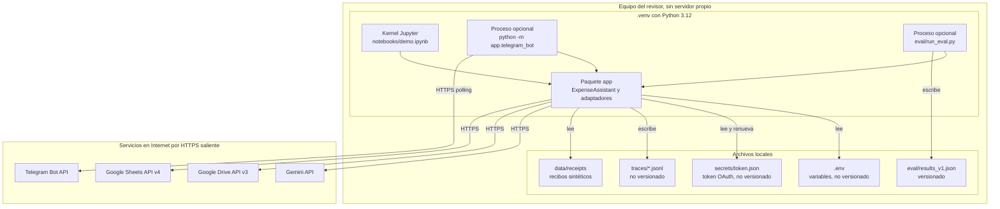

Todo se ejecuta en el equipo de quien lo usa: no hay servidor, contenedor, base de datos ni cola. El estado de conversación (`Conversation`, `AgentState`) vive en la memoria del proceso y se pierde al cerrarlo; lo único persistente son las trazas, el token OAuth y lo que ya está en Drive y Sheets. Las conexiones son todas salientes por HTTPS. Para el notebook solo se requieren `GEMINI_API_KEY` y `LLM_MODEL`; las variables de Google activan el registro real y las de Telegram solo afectan a la demo. Las credenciales se leen del entorno y de archivos locales ignorados por git, nunca del código ni del notebook.

---

## 9. Seguridad y controles

| Capa | Control | Dónde en el código | Prueba |
|---|---|---|---|
| Alcance del LLM | `SECURITY_SCOPE_v2` antepuesto a toda instrucción de sistema; un bloque de alcance no puede usarse como rol | `compose_system_instruction` en `app/prompts.py` y verificación en `LLMClient._generate` | `tests/test_stage8_security.py` (`test_compose_always_prepends_active_scope_for_every_role`, `test_scope_is_in_every_public_llm_call_path_and_trace`) |
| Flujo | Rutas sin tools; el router solo clasifica y ante una falla cae en `FUERA_DE_ALCANCE` | `app/router.py`, `ExpenseAssistant._handle` en `app/assistant.py` | `tests/test_stage9_router.py` (`test_non_registrar_routes_never_expose_or_call_tools`, `test_invalid_or_failed_router_output_falls_back_to_the_safe_route`) |
| Datos como dato | Mensaje, estado y datos extraídos van entre etiquetas y se neutralizan `<` y `>` | `_neutralize` en `app/router.py`, `app/assistant.py`, `app/judge.py` | `tests/test_stage9_router.py::test_state_and_question_cannot_close_the_data_delimiters` |
| Herramientas | Solo tres tools; ninguna mueve dinero ni borra | `build_tool_declarations` en `app/agent.py` | `tests/test_stage8_security.py::test_only_three_tools_are_declared_and_none_can_move_money` |
| Rieles del agente | Análisis previo obligatorio, URL de Drive proveniente de `guardar_recibo` en la misma ejecución, tool desconocida y argumentos faltantes | `_Dispatcher` en `app/agent.py` | `tests/test_stage8_security.py` (`test_rails_block_registrar_without_valid_url_even_if_llm_tries`, `test_unknown_tool_name_is_not_reflected_to_the_llm`) |
| Juez | Veredicto aplicado por código antes de guardar y registrar; piso de señales; falla cerrada | `judge_receipt`, `apply_signal_floor` en `app/judge.py`; `_judge_gate` en `app/agent.py` | `tests/test_stage11_judge.py` (`test_signal_floor_raises_but_never_lowers_the_verdict`, `test_rechazar_blocks_forever_cannot_be_confirmed_and_leaves_memory_untouched`, `test_judge_failure_fails_closed_as_rechazar_without_a_definitive_rejection`) |
| Confirmación del usuario | `confirmado_por_usuario` solo vale con una pendiente de un turno anterior | `_confirmation_gate` en `app/agent.py` | `tests/test_stage10_memory.py::test_same_turn_self_confirmation_is_rejected_and_nothing_is_written` |
| Deduplicación | Huella en memoria y deduplicación en la planilla; `permitir_duplicado` solo lo pasa el código | `app/memory.py`, `find_duplicate_row` y `registrar_gasto` en `app/tools/sheets.py` | `tests/test_stage5_sheets.py::test_duplicate_is_detected_without_append`; `tests/test_stage10_memory.py::test_permitir_duplicado_true_skips_only_the_dedup_and_appends` |
| Validación de escritura | Categoría, monto, fecha ISO, comercio y URL `https` de `drive.google.com`; solo `values.append` con `RAW` | `validate_expense` y `registrar_gasto` en `app/tools/sheets.py` | `tests/test_stage5_sheets.py::test_validation_failure_makes_zero_api_calls` |
| Saneamiento de errores | El LLM recibe `servicio_no_disponible` salvo prefijos de la lista blanca; red de seguridad final | `sanitize_failure`, `sanitize_observation` en `app/security.py` | `tests/test_stage8_security.py` (`test_drive_failure_is_generic_for_the_llm_and_detailed_only_in_trace`, `test_sanitize_observation_backstop_replaces_leaky_error_and_keeps_other_fields`) |
| Filtración de prompt | Frases canario y afirmaciones de acciones prohibidas (heurísticas) | `check_boundaries` en `app/security.py` | `tests/test_stage8_security.py` (`test_leaked_canaries_detects_prompt_fragments_case_insensitively`, `test_claimed_forbidden_action_detects_affirmative_claims`) |
| Credenciales | Solo variables de entorno; las variables OAuth deben ser rutas a `.json`; scope único `drive.file`; sin navegador en modo no interactivo | `app/config.py`, `app/google_auth.py` | `tests/test_stage2_config.py::test_oauth_variables_must_be_json_paths`; `tests/test_stage4_drive.py::test_load_credentials_non_interactive_never_opens_browser`; `tests/test_repo_hygiene.py` |
| Trazas | Enmascarado de secretos antes de consola y archivo | `mask_value` y `Tracer` en `app/trace.py` | `tests/test_stage2_trace.py::test_secrets_masked_in_console_and_file` |
| Telegram | Lista de chats autorizados, sesión aislada por chat, token enmascarado en registros, loggers de `httpx` y `telegram` en WARNING | `TelegramBot`, `install_log_protection` en `app/telegram_bot.py` | `tests/test_stage13_telegram.py` (`test_allowlist_blocks_other_chats_without_calling_agent`, `test_token_never_in_logs_or_trace`, `test_two_chats_are_isolated`) |

Las pruebas de la forma `tests/test_stageN_live.py` y los scripts `scripts/verify_stage_N.py` ejercen estos controles con servicios reales; no se listan arriba porque requieren credenciales. Las heurísticas de texto (canarios y afirmaciones prohibidas) no entienden todas las paráfrasis: la garantía fuerte es estructural (no existe una tool para transferir ni borrar y la traza muestra cero llamadas a herramientas).

---

## 10. Trazabilidad y observabilidad

`Tracer` (`app/trace.py`) registra cada evento como `TraceEvent` con `timestamp`, `event_type`, `data`, `session` y `step`; lo imprime en consola y lo agrega a `traces/<sesión>.jsonl`. Los eventos son los de `EventType`:

| Evento | Emisor | Contenido principal |
|---|---|---|
| `USER_INPUT` | `ExpenseAgent.run` y `ExpenseAssistant._record_input` | texto, si hay imagen, turno, mensajes de historial, ruta o `restored_pending` |
| `ROUTE` | `route_message` | ruta, motivo, `fallback`, `fallback_reason`, `pending_confirmation`, `prompt_id` |
| `LLM_DECISION` | `LLMClient._generate` | modelo, tipo de llamada, `system_prompt_id`, `security_scope_id`, parámetros, uso de tokens, latencia, intentos, estado |
| `TOOL_CALL` y `TOOL_RESULT` | `ExpenseAgent.run` (y cada tool en su propio trazador) | nombre, argumentos, resultado saneado, `diagnostic` si se ocultó un detalle |
| `JUDGE_VERDICT` | `judge_receipt` y `_run_judge` (veredicto reutilizado) | veredicto, motivo, señales, `prompt_id`, modelo, `fallback` |
| `MEMORY_UPDATE` | operaciones de `app/memory.py` | `operacion` (`record_expense`, `set_user_name`, `set_pending_confirmation`, `clear_pending_confirmation`, `reject_receipt`), `antes`, `despues`, `motivo` |
| `RETRY` | `LLMClient._generate` | `attempt`, `max_retries`, `wait_seconds`, `error_code`, `error_status` |
| `STOP` | agente y rutas sin tools | motivo, pasos, `security_scope_id` |
| `FINAL_RESPONSE` | agente y rutas sin tools | texto final y motivo de parada |

**Enmascarado.** `mask_value` actúa antes de mostrar o escribir cada evento: reemplaza por `***` los valores de las variables secretas definidas (`GEMINI_API_KEY`, `GOOGLE_OAUTH_CLIENT_SECRETS`, `GOOGLE_OAUTH_TOKEN`, `TELEGRAM_BOT_TOKEN`, de 4 o más caracteres), los secretos adicionales del `Tracer`, patrones conocidos (claves `AIza…`, tokens de bot, `Bearer`, claves privadas, rutas a archivos de credenciales o a `secrets/`) y el valor de cualquier campo cuyo nombre indique un secreto. Las métricas como `prompt_token_count` y claves de deduplicación no se enmascaran. `LLMClient` nunca registra la clave, el texto de los prompts ni los bytes de las imágenes, y `PendingConfirmation.imagen` queda fuera de la serialización.

**Contadores.** `LLMClient.stats` y `session_stats()` acumulan llamadas, llamadas fallidas, reintentos y tokens por cliente y por proceso; la última celda del notebook imprime el resumen. Ejemplos de trazas reales están en `docs/trace_examples.md`.

---

## 11. Evaluación

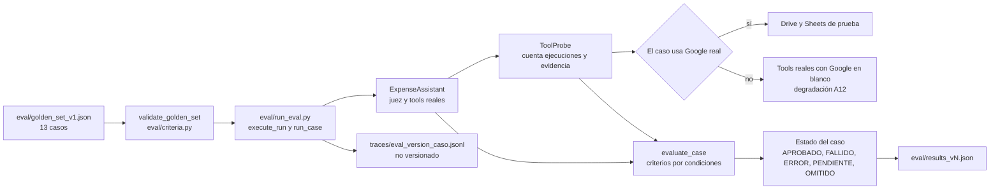

El arnés usa el `ExpenseAssistant` real con el juez de producción y el `LLMClient` habitual, de modo que respeta la pausa mínima y los reintentos. Cada caso corre con una `Conversation` y un `AgentState` nuevos; sus criterios son condiciones verificables, no textos exactos, y un criterio sin evidencia falla. El archivo de resultados se guarda después de cada caso y una cuota agotada deja el caso `PENDIENTE` y la corrida interrumpida (código de salida 3), nunca aprobada.

**Resultado real de la corrida v1** (`eval/results_v1.json`, modelo `gemini-3.5-flash-lite`, bloque de alcance `SECURITY_SCOPE_v2`, 2026-10-01): 13 casos, 13 `APROBADO`, 0 fallidos, 0 errores, 0 pendientes, tasa de aprobación 1,0, 65 llamadas al LLM, 119.912 tokens, sin interrupción. Detalle y política de versionado en `docs/evaluation.md`.

---

## 12. Decisiones de arquitectura

| Decisión | Alternativa descartada | Motivo | Referencia |
|---|---|---|---|
| OAuth de usuario con scope `drive.file` | Cuenta de servicio | Las cuentas de servicio no tienen cuota de almacenamiento ni pueden ser dueñas de archivos en Drive | A11 |
| Degradación controlada: errores estructurados, sin simulación | Modos simulados de Drive y Sheets | Con solo la clave de Gemini el flujo central funciona y nunca se finge un éxito | A12 |
| `SECURITY_SCOPE_v2` en toda llamada, garantizado por `LLMClient` | Confiar en que cada módulo incluya el bloque | Una omisión sería invisible; la garantía estructural la hace imposible | A13 |
| Juez aplicado por código después de cada análisis | Juez como tool opcional del LLM | Si el LLM pudiera omitirlo, el control no sería independiente | `docs/architecture.md`, Etapa 11 |
| Falla del juez como `RECHAZAR` con `juez_no_disponible` | `PEDIR_CONFIRMACION` ante una falla | La confirmación del usuario saltaría el control justo cuando no pudo ejecutarse | `app/judge.py` |
| Router previo con una ruta por intención y tools solo en `REGISTRAR_RECIBO` | Un solo prompt que decide todo | Hace observable la ruta y no expone tools cuando no corresponde | `docs/architecture.md`, Etapa 9 |
| `FUERA_DE_ALCANCE` como texto fijo en código | Rechazo redactado por el LLM | Es determinista, no gasta cuota y reduce la superficie ante una inyección | `app/assistant.py` |
| Memoria estructurada `AgentState` mantenida solo por código | Que el LLM resuma o recuerde los totales | Las cifras salen de lo observado; el LLM solo las redacta | `app/memory.py` |
| Confirmación solo en un turno posterior; `permitir_duplicado` fuera de las declaraciones de tools | Aceptar la confirmación en el mismo mensaje | El LLM no puede autoconfirmarse ni omitir la deduplicación | Etapa 10 |
| Planilla de solo agregar (`values.append`, `RAW`) | Edición o borrado de filas | Permite repetir la acción con seguridad; borrar queda fuera de alcance | `app/tools/sheets.py` |
| Estado y conversación en memoria, sin persistencia | Base de datos o Redis | No hay servidor ni dependencias adicionales; el stack permitido no incluye bases de datos | `AGENTS.md`, Etapa 10 |
| Notebook como entrega y Telegram como demo aparte | Notebook con Telegram | El revisor puede ejecutarlo sin crear un bot | `docs/architecture.md` |
| Temperatura 0,0 en extracción, agente, router, respuestas y juez | Temperatura 1,0 recomendada por Google para Gemini 3 | Reproducibilidad; la verificación real de la Etapa 3 mostró que el modelo acepta 0,0 en extracción, y el riesgo de bucles del agente está acotado por `MAX_STEPS` | `app/llm.py` |
